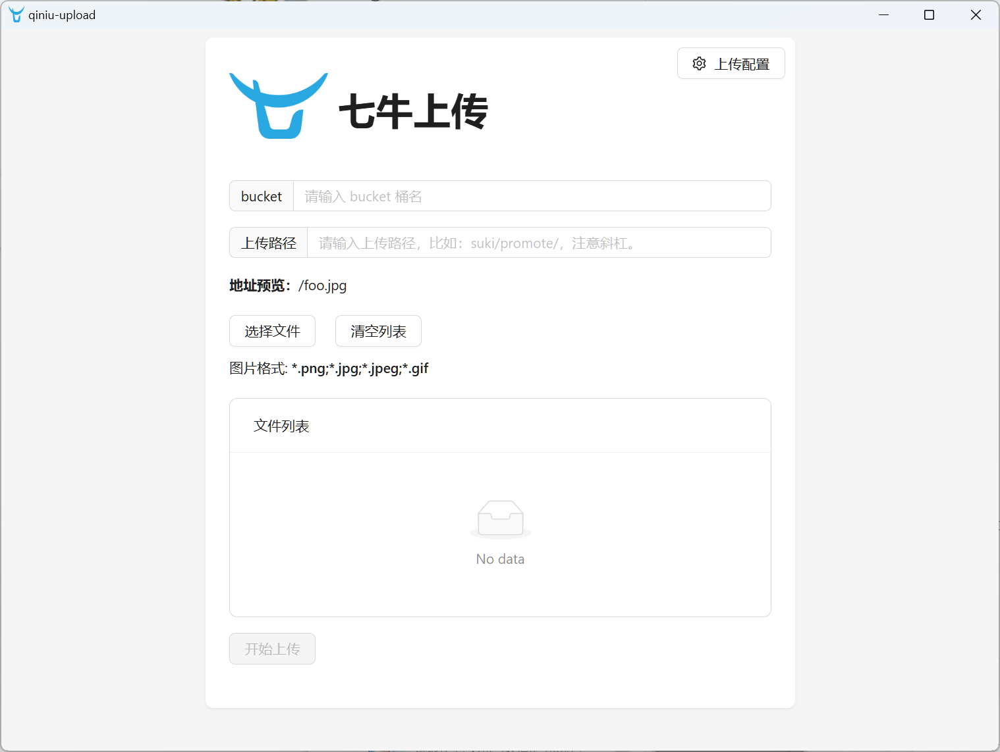
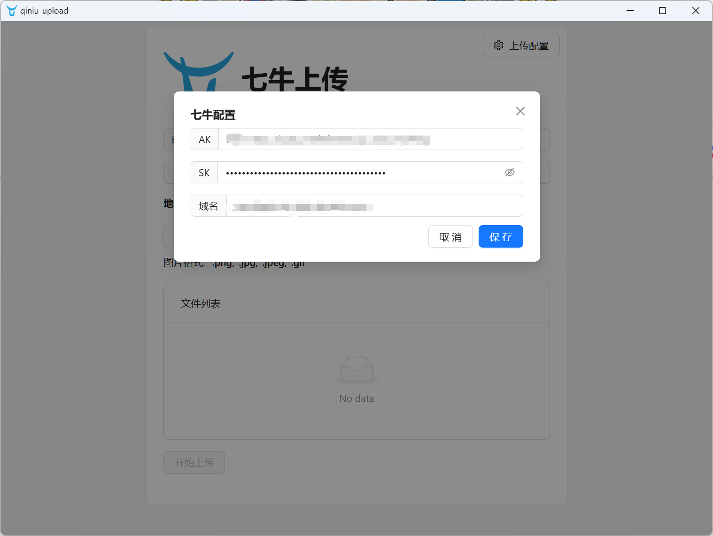
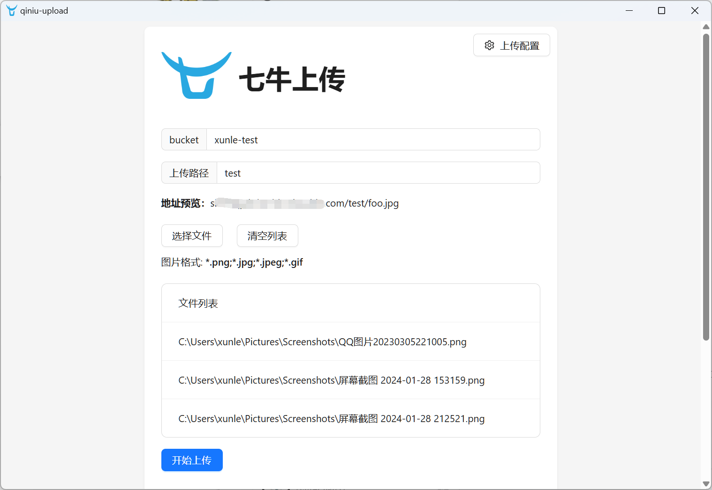
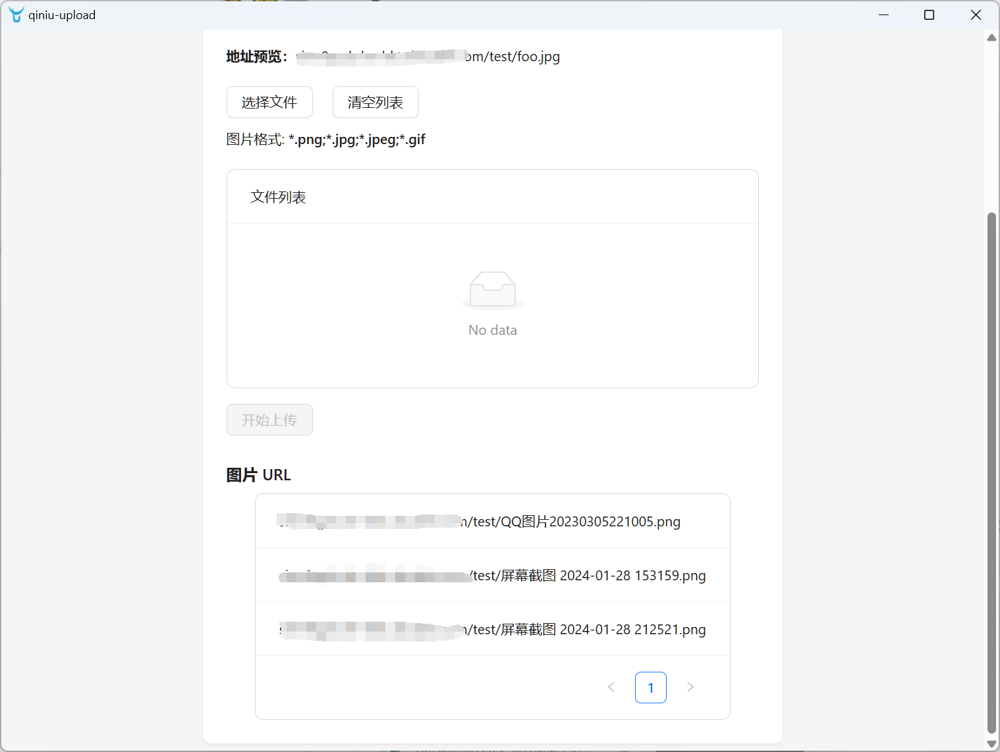

# qiniu-upload

基于 Wails 开发的跨平台七牛云上传图片工具，支持批量上传，生成图片链接。

## 使用

1. `上传配置` 中填写密钥，域名
2. `bucket` 中填写 bucket 名称
3. `上传路径` 中填写上传路径，比如：`test`，注意斜杠
4. `选择文件` 中选择需要上传的图片，可多选
5. `开始上传` 按钮，上传图片
6. 上传完成后，图片列表中会显示上传的图片 URL

### 截图









---

## 构建项目

环境要求参考：[Wails Installation](https://wails.io/docs/gettingstarted/installation)

### 运行

```shell
git clone git@github.com:Xunle1/qiniu-upload.git

cd qiniu-upload

make dev
```

### 构建

```
make build

# for macos arm64
make build-darwin-arm64

# for windows amd64
make build-windows-amd64
```

在 `build/bin` 目录下生成对应平台的可执行文件

---
